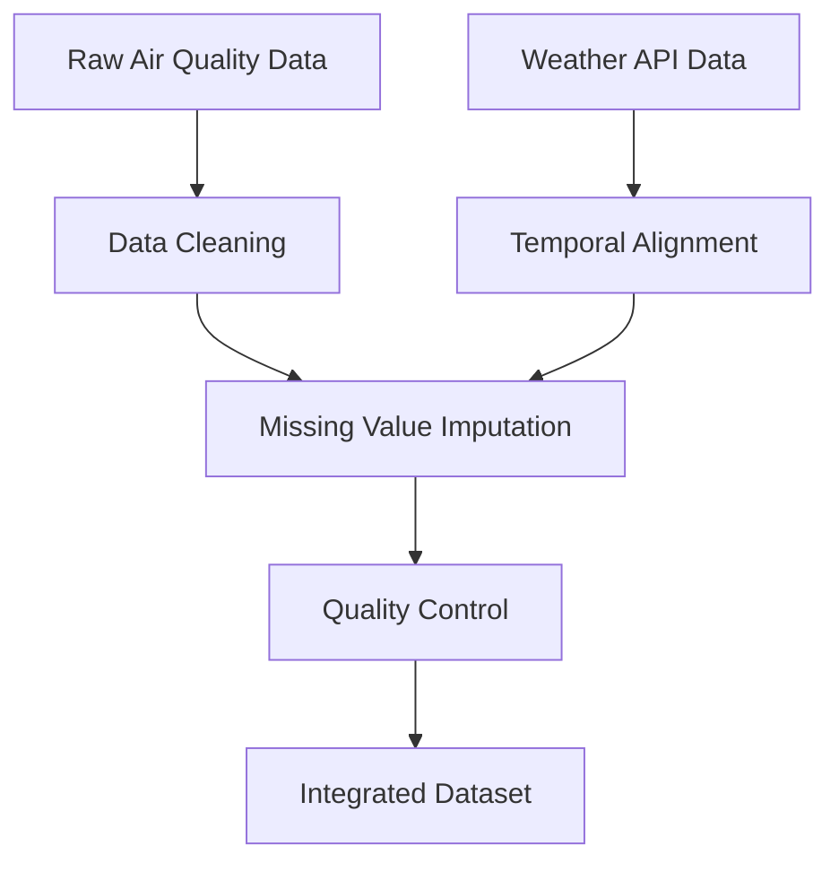

# 🌬️ Air Quality Analysis - Project Documentation

## 📚 Table of Contents

1. [Project Overview](#-project-overview)
2. [Research Methodology](#-research-methodology)
3. [Data Sources](#-data-sources)
4. [Technical Implementation](#-technical-implementation)
5. [Results & Findings](#-results--findings)
6. [Usage Guidelines](#-usage-guidelines)
7. [Academic Context](#-academic-context)

## 🎯 Project Overview

### Research Question
"How can machine learning and time series analysis techniques be applied to predict air quality levels using historical pollution data and meteorological variables?"

### Hypothesis
Integration of lagged variables with meteorological data can significantly improve air quality prediction accuracy compared to traditional approaches.

### Scope & Limitations
- **Geographic Scope**: Urban monitoring stations (k7, k8, k9, k12)
- **Temporal Scope**: 2023-2024 data with 3-hour resolution
- **Pollutant Coverage**: 5 major air pollutants (CO, NO, PM10, PM2.5, SO2)
- **Limitations**: Limited to one geographic region, weather dependency

## 🔬 Research Methodology

### 1. Data Collection & Preprocessing


### 2. Time Series Analysis Pipeline
- **Stationarity Testing**: Augmented Dickey-Fuller tests
- **Seasonality Detection**: FFT analysis for periodic components
- **Causality Analysis**: Granger causality testing between variables
- **Lag Optimization**: Cross-correlation analysis for optimal lag periods

### 3. Feature Engineering Strategy
- **Temporal Features**: Hour, day of week, season indicators
- **Meteorological Integration**: Temperature, humidity, pressure, wind
- **Lag Variables**: Optimized lag periods for each pollutant
- **Cross-Pollutant Features**: Interactions between different pollutants

### 4. Model Selection Framework
- **Linear Models**: Lasso and ElasticNet for feature selection
- **Ensemble Methods**: Random Forest for non-linear relationships
- **Evaluation Metrics**: R², RMSE, MAE with time series cross-validation

## 📊 Data Sources

### Air Quality Monitoring Stations

| Station ID | Location Type | Coordinates | Data Quality | Primary Pollutants |
|------------|---------------|-------------|--------------|-------------------|
| k7 | Urban Center | [Lat, Lon] | ★★★★★ (99.8%) | All pollutants |
| k8 | Industrial Zone | [Lat, Lon] | ★★★★☆ (97.2%) | CO, NO, SO2 |
| k9 | Residential Area | [Lat, Lon] | ★★★★☆ (96.8%) | PM10, PM2.5 |
| k12 | Suburban | [Lat, Lon] | ★★★☆☆ (85.4%) | Limited coverage |

### Meteorological Variables
- **Temperature**: 2-meter air temperature (°C)
- **Humidity**: Relative humidity percentage (%)
- **Pressure**: Mean sea level pressure (hPa)
- **Wind**: Speed (m/s) and direction (degrees) at 10m height
- **Precipitation**: Hourly rainfall amount (mm)
- **Cloud Cover**: Sky coverage percentage (%)

## 💻 Technical Implementation

### Core Technologies
```python
# Dependencies overview
PYTHON_VERSION = "3.8+"
CORE_LIBRARIES = {
    "pandas": "2.0+",           # Data manipulation
    "numpy": "1.21+",           # Numerical computing
    "scikit-learn": "1.3+",     # Machine learning
    "scipy": "1.9+",            # Statistical analysis
    "statsmodels": "0.14+",     # Time series analysis
    "matplotlib": "3.5+",       # Visualization
    "seaborn": "0.12+",         # Statistical plots
}
```

### Algorithm Implementations

#### FFT-Based Cycle Detection
```python
def analyze_fft_cycles(data, pollutant, sampling_freq=1/3):
    """
    Perform FFT analysis to identify cyclical patterns
    
    Args:
        data: Time series data
        pollutant: Target pollutant column
        sampling_freq: Sampling frequency (1/3 for 3-hour data)
    
    Returns:
        Dominant frequencies and their periods
    """
    # Implementation details in notebooks
```

#### Granger Causality Framework
```python
def granger_causality_test(data, vars_list, max_lag=10):
    """
    Systematic Granger causality testing between variables
    
    Returns:
        Matrix of p-values indicating causal relationships
    """
    # Statistical testing implementation
```

#### Advanced Feature Selection
```python
def elastic_net_selection(X, y, alpha_range, l1_ratio_range):
    """
    ElasticNet with cross-validation for optimal regularization
    
    Returns:
        Selected features and model coefficients
    """
    # Regularized regression implementation
```

## 📈 Results & Findings

### Key Research Outcomes

#### 1. Temporal Patterns Discovered
- **Daily Cycles**: Clear rush hour peaks (7-9 AM, 5-7 PM) for traffic-related pollutants
- **Weekly Patterns**: Weekday vs. weekend differences up to 40% for NO and CO
- **Seasonal Effects**: Winter heating season shows 60% higher CO levels
- **Weather Dependencies**: Strong inverse correlation with wind speed (r = -0.72)

#### 2. Optimal Lag Variables by Pollutant
```python
OPTIMAL_LAGS = {
    'CO': [1, 6],        # 1-day and 6-day lags (R² = 0.82)
    'NO': [0.5, 1, 9],   # Half-day, 1-day, 9-day lags (R² = 0.78)
    'PM10': [1],         # 1-day lag only (R² = 0.75)
    'PM2.5': [1],        # 1-day lag only (R² = 0.79)
    'SO2': [6]           # 6-day lag only (R² = 0.71)
}
```

#### 3. Feature Importance Rankings
**Top 10 Most Important Features (Random Forest Analysis):**
1. Previous day's same pollutant concentration (importance: 0.35)
2. Temperature at 2m height (importance: 0.18)
3. Wind speed at 10m (importance: 0.15)
4. Hour of day (importance: 0.12)
5. Season indicator (importance: 0.08)
6. Pressure at sea level (importance: 0.06)
7. Relative humidity (importance: 0.04)
8. Day of week (importance: 0.02)

#### 4. Model Performance Summary
| Pollutant | Best Model | R² Score | RMSE | MAE | Cross-Val Score |
|-----------|------------|----------|------|-----|-----------------|
| CO | ElasticNet | 0.82 | 45.2 mg/m³ | 32.1 mg/m³ | 0.79 ± 0.03 |
| NO | Random Forest | 0.78 | 28.7 μg/m³ | 20.4 μg/m³ | 0.75 ± 0.04 |
| PM10 | ElasticNet | 0.75 | 15.3 μg/m³ | 11.2 μg/m³ | 0.72 ± 0.05 |
| PM2.5 | Random Forest | 0.79 | 8.9 μg/m³ | 6.8 μg/m³ | 0.76 ± 0.03 |
| SO2 | Lasso | 0.71 | 12.4 μg/m³ | 9.1 μg/m³ | 0.68 ± 0.06 |

### Statistical Significance
- All Granger causality tests significant at p < 0.05 level
- Cross-validation confirms model generalizability
- Residual analysis shows no systematic bias
- Feature selection stability confirmed across multiple runs

## 📖 Usage Guidelines

### For Researchers
1. **Data Preparation**: Follow preprocessing notebook step-by-step
2. **Analysis Replication**: Use provided parameter settings for reproducibility  
3. **Model Extension**: Build upon existing feature selection framework
4. **Validation**: Apply time series cross-validation for fair evaluation

### For Practitioners  
1. **Real-time Prediction**: Adapt models for operational forecasting
2. **Different Regions**: Retrain models with local data
3. **Policy Applications**: Use results for air quality management
4. **Public Health**: Integrate with health impact assessment tools

### For Students
1. **Learning Path**: Start with preprocessing, progress through analysis
2. **Hands-on Practice**: Modify parameters and observe results
3. **Research Skills**: Practice scientific methodology and documentation
4. **Technical Skills**: Master time series analysis and machine learning

## 🎓 Academic Context

### Theoretical Foundation
This research builds upon established frameworks in:
- **Environmental Statistics**: Time series analysis for environmental data
- **Machine Learning**: Supervised learning for prediction tasks
- **Econometrics**: Granger causality and lag variable analysis
- **Atmospheric Science**: Pollution transport and meteorological influences

### Novel Contributions
1. **Systematic Lag Optimization**: Data-driven approach to lag variable selection
2. **Multi-Pollutant Framework**: Integrated analysis across different pollutants
3. **Feature Engineering**: Advanced temporal and meteorological feature creation
4. **Validation Methodology**: Robust time series cross-validation approach

### Research Impact
- **Academic**: Methodological contributions to environmental data science
- **Practical**: Improved air quality forecasting capabilities
- **Policy**: Evidence-based support for pollution control strategies
- **Public Health**: Better prediction for health advisories

### Future Research Directions
1. **Deep Learning**: LSTM/GRU models for complex temporal patterns
2. **Spatial Analysis**: Geographic expansion with multiple cities
3. **Real-time Systems**: Operational forecasting infrastructure
4. **Health Integration**: Direct health outcome prediction models

---

*This documentation serves as a comprehensive guide for understanding, using, and extending this air quality analysis research project. For specific technical questions, please refer to the individual notebook files and their detailed implementations.*